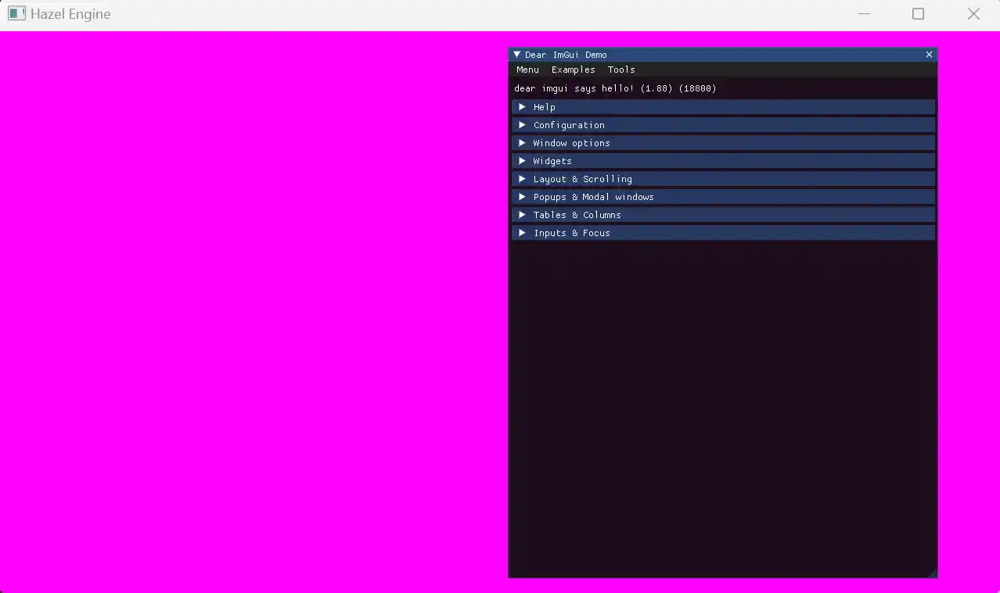

---


# 一、封装 ImGuiLayer 与移植后端

将 ImGui 后端文件移植到引擎的平台目录，并封装为ImGuiLayer（Overlay 层），接入引擎的层系统。

## 1.1 移植 ImGui 后端文件

ImGui 的后端文件（`imgui_impl_glfw.cpp`、`imgui_impl_opengl3.cpp`）需按引擎的平台结构存放，步骤如下：
- 从Hazel/vendor/ImGui/backends目录，复制以下 2 个文件：
  `imgui_impl_opengl3.h`、`imgui_impl_opengl3.cpp`（OpenGL 渲染对接）

- 将复制的文件粘贴到Hazel/src/Platform/OpenGL目录下；

- 重命名文件（可选，与引擎命名规范一致）：
  imgui_impl_opengl3.h → `ImGuiOpenGLRenderer.h`

  imgui_impl_opengl3.cpp → `ImGuiOpenGLRenderer.cpp`
（重命名原因：明确这是 OpenGL 平台的 ImGui 渲染器，与其他平台后端区分）

## 1.2 封装 ImGuiLayer 类（引擎层接口）

创建ImGuiLayer类，继承自 Hazel 的Layer，负责 ImGui 的初始化、帧更新与销毁，作为引擎对外的统一 UI 接口。

```cpp
//ImGuiLayer.h
#include "Hazel/Layer.h"

namespace Hazel {
    class HAZEL_API ImGuiLayer : public Layer{
    public:
        ImGuiLayer();
        ~ImGuiLayer();

        void OnAttach();
        void OnDetach();
        void OnUpdate();
        //void OnEvent(Event& event);// 先渲染，后面实现事件
    private:
        float m_Time = 0.0f;
    };
}
```
```cpp
//ImGuiLayer.cpp
#include "Platform/OpenGL/ImGuiOpenGLRenderer.h"
#include "GLFW/glfw3.h"
......
void ImGuiLayer::OnAttach(){
    ImGui::CreateContext();
    ImGui::StyleColorsDark();

    ImGuiIO& io = ImGui::GetIO();
    io.BackendFlags |= ImGuiBackendFlags_HasMouseCursors;	// 光标
    io.BackendFlags |= ImGuiBackendFlags_HasSetMousePos;

    // imgui输入key对应glfw的key，临时的：最终会对应引擎自身的key
    io.KeyMap[ImGuiKey_Tab] = GLFW_KEY_TAB;
    io.KeyMap[ImGuiKey_LeftArrow] = GLFW_KEY_LEFT;
    io.KeyMap[ImGuiKey_RightArrow] = GLFW_KEY_RIGHT;
    io.KeyMap[ImGuiKey_UpArrow] = GLFW_KEY_UP;
    io.KeyMap[ImGuiKey_DownArrow] = GLFW_KEY_DOWN;
    io.KeyMap[ImGuiKey_PageUp] = GLFW_KEY_PAGE_UP;
    io.KeyMap[ImGuiKey_PageDown] = GLFW_KEY_PAGE_DOWN;
    io.KeyMap[ImGuiKey_Home] = GLFW_KEY_HOME;
    io.KeyMap[ImGuiKey_End] = GLFW_KEY_END;
    io.KeyMap[ImGuiKey_Insert] = GLFW_KEY_INSERT;
    io.KeyMap[ImGuiKey_Delete] = GLFW_KEY_DELETE;
    io.KeyMap[ImGuiKey_Backspace] = GLFW_KEY_BACKSPACE;
    io.KeyMap[ImGuiKey_Space] = GLFW_KEY_SPACE;
    io.KeyMap[ImGuiKey_Enter] = GLFW_KEY_ENTER;
    io.KeyMap[ImGuiKey_Escape] = GLFW_KEY_ESCAPE;
    io.KeyMap[ImGuiKey_A] = GLFW_KEY_A;
    io.KeyMap[ImGuiKey_C] = GLFW_KEY_C;
    io.KeyMap[ImGuiKey_V] = GLFW_KEY_V;
    io.KeyMap[ImGuiKey_X] = GLFW_KEY_X;
    io.KeyMap[ImGuiKey_Y] = GLFW_KEY_Y;
    io.KeyMap[ImGuiKey_Z] = GLFW_KEY_Z;

    ImGui_ImplOpenGL3_Init("#version 410");
}
void ImGuiLayer::OnUpdate(){
    ImGuiIO& io = ImGui::GetIO();
    Application& app = Application::Get();
    io.DisplaySize = ImVec2(app.GetWindow().GetWidth(), app.GetWindow().GetHeight());

    float time = (float)glfwGetTime();
    io.DeltaTime = m_Time > 0.0f ? (time - m_Time) : (1.0f / 60.0f);
    m_Time = time;

    // 需创建窗口后才执行下面
    ImGui_ImplOpenGL3_NewFrame();
    ImGui::NewFrame();

    static bool show = true;
    // 显示ImGui Demo////////////////////////////////////////////
    ImGui::ShowDemoWindow(&show);
    ImGui::Render();
    ImGui_ImplOpenGL3_RenderDrawData(ImGui::GetDrawData());
}
```

关于在ImGuiLayer类中的OnAttach和OnUpdate函数中的ImGui代码

都是参考examples\example_glfw_opengl3\main.cpp与imgui_impl_glfw上的例子代码

ImGuiLayer对应main.cpp引入ImGuiOpenGLRenderer.h(imgui_impl_opengl3.h)使用其函数，从而在屏幕上显示ImGui

ImGui的key键值对应GLFW窗口的key键值

# 二、集成到游戏项目：显示 ImGui UI

在 Sandbox 游戏项目中，将ImGuiLayer作为Overlay 层推入引擎，确保其渲染优先级最高（显示在所有普通 Layer 上方）。

```cpp
//SandboxApp.cpp
class Sandbox : public Hazel::Application
{
public:
    Sandbox()
    {
        PushLayer(new ExampleLayer());
        PushOverlay(new Hazel::ImGuiLayer());// UI层放到最后面显示在屏幕的上方
    }
    ~Sandbox()
    {
    }
};
```



已完成 ImGui 层渲染后，事件处理是核心下一步 —— 需将引擎的鼠标、键盘、文本输入等事件传递给 ImGui，同时实现 “UI 捕获事件” 逻辑（比如点击 UI 时，游戏逻辑不再响应相同事件），确保交互体验符合预期。

# 三、ImGui 事件依赖与引擎对接逻辑

ImGui 本身不直接捕获系统事件，需通过**引擎事件系统转发**，关键依赖两个核心：

1. **ImGui IO 对象**：通过ImGui::GetIO()获取，内部维护MousePos（鼠标位置）、MouseDown（鼠标按钮状态）、KeysDown（键盘状态）等数组，事件处理本质是 “更新这些数组状态”；
2. **事件捕获标志**：ImGui IO 的WantCaptureMouse（是否需要捕获鼠标事件）和WantCaptureKeyboard（是否需要捕获键盘事件）—— 当鼠标悬停在 UI 上或 UI 处于激活状态时，这两个标志会自动设为true，引擎需根据标志决定是否阻止事件向下传递给其他 Layer。

## 前置准备：确认引擎事件系统基础

需确保引擎已实现以下基础事件类（若未实现，需先补充），事件类需继承自核心Event类，包含事件类型、事件处理状态等信息：

| 事件类型                                               | 核心成员/方法                                                               |
| -------------------------------------------------- | --------------------------------------------------------------------- |
| `MouseMovedEvent`                                  | float GetX() const、float GetY() const（获取鼠标坐标）                         |
| `MouseButtonPressedEvent/MouseButtonReleasedEvent` | int GetMouseButton() const（获取鼠标按钮，如左键 = 0、右键 = 1）                     |
| `MouseScrolledEvent`                               | float GetXOffset() const（水平滚轮）、float GetYOffset() const（垂直滚轮）         |
| `KeyPressedEvent/KeyReleasedEvent`                 | int GetKeyCode() const（获取键码，如 HZ_KEY_A）、bool IsRepeat() const（是否重复触发） |
| `KeyTypedEvent`                                    |  unsigned int GetKeyCode() const（获取输入的 Unicode 字符，用于文本输入）             |

## 代码实现：ImGuiLayer 事件处理

分两步实现：先在ImGuiLayer.h声明事件处理函数，再在ImGuiLayer.cpp中按事件类型分发处理，最后通过 “事件捕获标志” 控制事件传递。

### 第一步：声明事件处理函数（ImGuiLayer.h）

在ImGuiLayer类中添加OnEvent虚函数（重写父类Layer的OnEvent），同时声明事件分发的辅助函数（可选，让代码更清晰）：

```cpp
//ImGuiLayer.h
#include "Hazel/Event/ApplicationEvent.h"
#include "Hazel/Event/MouseEvent.h"
#include "Hazel/Event/KeyEvent.h"

namespace Hazel {
    class HAZEL_API ImGuiLayer : public Layer {
    public:
        ImGuiLayer();
        ~ImGuiLayer();

        // 层生命周期函数
        void OnAttach(); // 初始化ImGui上下文和设置
        void OnDetach(); // 清理ImGui资源
        void OnUpdate(); // 每帧更新ImGui
        void OnEvent(Event& e);  // 处理ImGui事件

    private:
        bool OnMouseButtonPressedEvent(MouseButtonPressedEvent& e);
        bool OnMouseButtonReleasedEvent(MouseButtonReleasedEvent& e);
        bool OnMouseMovedEvent(MouseMovedEvent& e);
        bool OnMouseScrolledEvent(MouseScrolledEvent& e);
        bool OnKeyPressedEvent(KeyPressedEvent& e);
        bool OnKeyReleasedEvent(KeyReleasedEvent& e);
        bool OnKeyTypedEvent(KeyTypedEvent& e);
        bool OnWindowResizeEvent(WindowResizeEvent& e);

    private:
        // 记录时间（用于ImGui计算帧率和动画）
        float m_Time = 0.0f;
    };
}
```

### 第二步：实现事件处理逻辑（ImGuiLayer.cpp）

核心是 “通过EventDispatcher分发事件→调用对应辅助函数更新 ImGui IO 状态→根据WantCapture标志返回事件是否被处理”。

- 事件处理函数

```cpp
//ImGuiLayer.cpp
void ImGuiLayer::OnEvent(Event& e)
{
    EventDispatcher dispatcher(e);
    dispatcher.Dispatch<MouseButtonPressedEvent>(HZ_BIND_EVENT_FN(ImGuiLayer::OnMouseButtonPressedEvent));
    dispatcher.Dispatch<MouseButtonReleasedEvent>(HZ_BIND_EVENT_FN(ImGuiLayer::OnMouseButtonReleasedEvent));
    dispatcher.Dispatch<MouseMovedEvent>(HZ_BIND_EVENT_FN(ImGuiLayer::OnMouseMovedEvent));
    dispatcher.Dispatch<MouseScrolledEvent>(HZ_BIND_EVENT_FN(ImGuiLayer::OnMouseScrolledEvent));
    dispatcher.Dispatch<KeyPressedEvent>(HZ_BIND_EVENT_FN(ImGuiLayer::OnKeyPressedEvent));
    dispatcher.Dispatch<KeyReleasedEvent>(HZ_BIND_EVENT_FN(ImGuiLayer::OnKeyReleasedEvent));
    dispatcher.Dispatch<KeyTypedEvent>(HZ_BIND_EVENT_FN(ImGuiLayer::OnKeyTypedEvent));
    dispatcher.Dispatch<WindowResizeEvent>(HZ_BIND_EVENT_FN(ImGuiLayer::OnWindowResizeEvent));
}

bool ImGuiLayer::OnMouseButtonPressedEvent(MouseButtonPressedEvent& e)
{
    ImGuiIO& io = ImGui::GetIO();
    io.MouseDown[e.GetMouseButton()] = true;

    return false;// 不阻止事件传递 给后面的层 处理 why
}

bool ImGuiLayer::OnMouseButtonReleasedEvent(MouseButtonReleasedEvent& e)
{
    ImGuiIO& io = ImGui::GetIO();
    io.MouseDown[e.GetMouseButton()] = false;

    return false;
}

bool ImGuiLayer::OnMouseMovedEvent(MouseMovedEvent& e)
{
    ImGuiIO& io = ImGui::GetIO();
    io.MousePos = ImVec2(e.GetX(), e.GetY());
    return false;
}

bool ImGuiLayer::OnMouseScrolledEvent(MouseScrolledEvent& e)
{
    ImGuiIO& io = ImGui::GetIO();
    // 垂直滚轮：向上滚为正，向下滚为负（与引擎事件的YOffset一致）
    io.MouseWheel += e.GetYOffset();
    // 水平滚轮：向右滚为正，向左滚为负（与引擎事件的XOffset一致）
    io.MouseWheelH += e.GetXOffset();

    return false;
}

bool ImGuiLayer::OnKeyPressedEvent(KeyPressedEvent& e)
{
    ImGuiIO& io = ImGui::GetIO();
    io.KeysDown[e.GetKeyCode()] = true;
    // 处理按键重复
    io.KeyCtrl = io.KeysDown[GLFW_KEY_LEFT_CONTROL] || io.KeysDown[GLFW_KEY_RIGHT_CONTROL];
    io.KeyShift = io.KeysDown[GLFW_KEY_LEFT_SHIFT] || io.KeysDown[GLFW_KEY_RIGHT_SHIFT];
    io.KeyAlt = io.KeysDown[GLFW_KEY_LEFT_ALT] || io.KeysDown[GLFW_KEY_RIGHT_ALT];
    io.KeySuper = io.KeysDown[GLFW_KEY_LEFT_SUPER] || io.KeysDown[GLFW_KEY_RIGHT_SUPER];
    return false;
}

bool ImGuiLayer::OnKeyReleasedEvent(KeyReleasedEvent& e)
{
    ImGuiIO& io = ImGui::GetIO();
    io.KeysDown[e.GetKeyCode()] = false;

    return false;
}

bool ImGuiLayer::OnKeyTypedEvent(KeyTypedEvent& e)
{
    ImGuiIO& io = ImGui::GetIO();
    // 获取输入的Unicode字符
    unsigned int keycode = e.GetKeyCode();
    // 过滤不可见字符（如退格、回车，ImGui会通过KeysDown处理），只添加可显示字符
    if (keycode > 0 && keycode < 0x10000)
        io.AddInputCharacter((unsigned short)keycode);
    return false;
}

bool ImGuiLayer::OnWindowResizeEvent(WindowResizeEvent& e)
{
    ImGuiIO& io = ImGui::GetIO();
    io.DisplaySize = ImVec2((float)e.GetWidth(), (float)e.GetHeight());
    io.DisplayFramebufferScale = ImVec2(1.0f, 1.0f);
    glViewport(0, 0, e.GetWidth(), e.GetHeight());

    return false;
}
```

## 测试验证：确保事件正常工作

完成代码后，通过以下场景测试事件是否生效：

1. 鼠标交互：
- 悬停在 ImGui 按钮上，按钮变色（证明鼠标移动事件生效）；
- 点击按钮，触发按钮回调（证明鼠标按钮事件生效）；
- 滚动 ImGui 窗口的滚动条，窗口内容滚动（证明鼠标滚轮事件生效）。

2. 键盘交互：
- 在 ImGui 输入框中输入英文（中文），文本正常显示（证明文本输入事件生效）；

# 四、bug记录及解决方案


这个错误是指Sandbox项目找不到imgui头文件，错误原因:

SandboxApp包含的Hazel头文件包含imgui/imgui.h，这对Hazel项目是没问题的，因为Hazel项目的premake5附加了包含目录vendor，
已知包含文件相当于将文件的内容拷贝到当前文件，所以相当于SandboxApp.cpp文件中包含了imgui/imgui.h头文件，
但是Sandbox项目的premake5没有附加vendor目录，所以找不到imgui头文件，解决方案：

在Sandbox项目的premake5.lua中添加包含目录vendor，如下所示：
```lua
includedirs {
    "Hazel/src",
    "Hazel/vendor // 添加这一行
}
```
