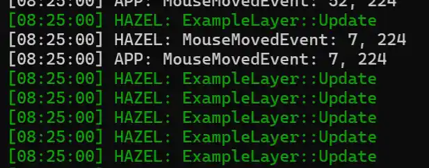

---


# 一、核心问题：为什么需要层（Layer）系统？

在已有窗口系统和事件系统的基础上，层系统是管理复杂场景逻辑、控制事件优先级与渲染顺序的核心机制，本质是解决 “代码耦合”“逻辑混乱” 问题，让引擎更模块化、易维护。

## 1. 逻辑分离与模块化：避免代码堆砌

游戏包含多个独立逻辑模块（如 3D 场景、UI 交互、调试信息），层系统将这些逻辑 “隔离” 到专属层，每个层只负责单一职责：
GameLayer：处理核心玩法（角色移动、碰撞检测、敌人 AI）
UILayer：处理 UI 交互（按钮点击、输入框、血条更新）
DebugLayer：显示调试信息（帧率、碰撞盒、日志输出）
优势：修改某类逻辑时（如调整 UI 样式），只需改动对应层，不影响其他模块（如游戏场景）。

## 2. 事件优先级控制：解决 “谁先响应”

事件（鼠标点击、键盘输入）需按 “视觉层级” 优先响应 ——屏幕顶层元素应先处理事件，层系统通过 “反向遍历” 实现：
事件从 “最顶层的层” 向 “最底层的层” 传递
若某层处理完事件后标记 e.Handled = true，事件会停止向下传递（避免底层误响应）
示例：点击 UI 按钮时，UILayer先处理并拦截事件，GameLayer不会误触发 “角色移动”。

## 3. 渲染顺序管理：确保视觉正确

渲染顺序决定 “谁覆盖谁”，必须符合 “视觉逻辑”（如 UI 在 3D 场景之上、调试信息在最顶层）。层系统的渲染顺序与 “层在容器中的顺序” 完全一致：
容器中靠前的层先渲染（如GameLayer）
容器中靠后的层后渲染（如UILayer）
后渲染的层会覆盖先渲染的层，保证视觉层级正确

## 4. 状态切换便捷性：批量控制逻辑

支持 “批量启用 / 禁用” 或 “动态切换” 层，简化场景切换、暂停等功能：
暂停游戏：禁用GameLayer（停止角色更新），保留UILayer（显示暂停菜单）
场景切换：移除当前所有层，添加新场景的层（如从 “主菜单层” 切换到 “关卡层”）

# 二、Layer 核心概念理解

用 “生活类比 + 技术逻辑” 快速掌握核心设计：

## 1. 层的本质：类比 “PS 图层 / 叠纸”

PS 图层：一张图由多个图层组成，上层覆盖下层，可单独编辑某一层
引擎层：游戏画面由多个层组成，上层（UI）覆盖下层（场景），可单独更新 / 禁用某一层

## 2. 核心设计：数据结构与关键顺序

| 设计点      | 具体实现              | 核心目的                           |
|-------------|-----------------------|--------------------------------    |
| 数据结构    | std::vector<Layer*>   | 支持随机访问、插入 / 删除，效率高  |
| 渲染顺序    | 正向遍历（头→尾）    | 后渲染的层覆盖先渲染的层           |
| 事件处理顺序| 反向遍历（尾→头）    | 顶层元素优先响应事件               |

## 3. 层的分类：普通层 vs Overlay（覆盖层）

通过LayerStack中的m_LayerInsert迭代器区分两类层，确保Overlay 始终在所有普通层之上：
普通层：游戏核心逻辑层（如GameLayer、UILayer），按添加顺序堆叠
Overlay：全局覆盖层（如DebugLayer、弹窗层），始终在普通层之上
m_LayerInsert作用：作为 “普通层与 Overlay 的分界线”—— 普通层插入到m_LayerInsert前，Overlay 插入到 vector 末尾。

# 三、核心代码实现（带关键注释）

- 1. 层基类：Layer.h（定义生命周期）
```cpp
//Layer.h
namespace Hazel {
    class HAZEL_API Layer
    {
    public:
        // 构造：传入层名称（用于调试日志）
        Layer(const std::string& name = "Layer") : m_DebugName(name) {}
        // 虚析构：确保子类析构时能正确调用（避免内存泄漏）
        virtual ~Layer() {}

        // 生命周期函数：由LayerStack自动调用
        virtual void OnAttach() {}  // 层被添加时调用（初始化资源：如加载纹理）
        virtual void OnDetach() {}  // 层被移除时调用（释放资源：如销毁组件）
        virtual void OnUpdate() {}  // 每帧调用（更新逻辑：如角色位置、UI动画）
        virtual void OnEvent(Event& event) {}  // 处理事件（如点击、键盘输入）

        // 获取层名称（调试时打印日志用）
        inline const std::string& GetName() const { return m_DebugName; }

    protected:
        std::string m_DebugName;  // 层的调试名称（非必需，但便于定位问题）
    };
}
```

- 2. 层栈管理：LayerStack.h（管理层的添加 / 删除）
```cpp
//LayerStack.h
#include "Hazel/Layer.h"
#include <vector>

namespace Hazel {
    class HAZEL_API LayerStack
    {
    public:
        LayerStack();
        ~LayerStack();  // 析构时释放所有层内存（防止内存泄漏）

        // 插入普通层（到m_LayerInsert前）
        void PushLayer(Layer* layer);
        // 插入Overlay（到vector末尾）
        void PushOverlay(Layer* overlay);
        // 移除普通层（需更新m_LayerInsert，避免迭代器失效）
        void PopLayer(Layer* layer);
        // 移除Overlay（无需更新m_LayerInsert）
        void PopOverlay(Layer* overlay);

        // 迭代器：供Application遍历层（更新/渲染）
        std::vector<Layer*>::iterator begin() { return m_Layers.begin(); }
        std::vector<Layer*>::iterator end() { return m_Layers.end(); }

    private:
        std::vector<Layer*> m_Layers;  // 存储所有层的容器
        // 核心分界迭代器：指向普通层末尾、Overlay开头
        std::vector<Layer*>::iterator m_LayerInsert;
    };
}
```

- 3. 层栈实现：LayerStack.cpp（核心逻辑落地）
```cpp
//LayerStack.cpp
#include "hzpch.h"
#include "LayerStack.h"
#include <algorithm>  // 用于std::find

namespace Hazel {
    // 构造：初始化分界迭代器（指向vector开头，此时无层）
    LayerStack::LayerStack() {
        m_LayerInsert = m_Layers.begin();
    }

    // 析构：遍历所有层，释放动态分配的内存（Layer由new创建）
    LayerStack::~LayerStack() {
        for (Layer* layer : m_Layers)
            delete layer;
    }

    // 插入普通层：保证普通层按添加顺序堆叠
    void LayerStack::PushLayer(Layer* layer) {
        // emplace：在m_LayerInsert位置插入层，返回新元素迭代器
        // 更新m_LayerInsert：确保下次插入普通层仍在正确位置
        m_LayerInsert = m_Layers.emplace(m_LayerInsert, layer);
        layer->OnAttach();  // 插入后初始化层资源
    }

    // 插入Overlay：直接放vector末尾，确保在所有普通层之上
    void LayerStack::PushOverlay(Layer* overlay) {
        m_Layers.emplace_back(overlay);
        overlay->OnAttach();  // 初始化Overlay资源
    }

    // 移除普通层：处理迭代器失效问题
    void LayerStack::PopLayer(Layer* layer) {
        auto it = std::find(m_Layers.begin(), m_Layers.end(), layer);
        if (it != m_Layers.end()) {
            layer->OnDetach();  // 移除前释放层资源
            m_Layers.erase(it); // 删除层
            m_LayerInsert = it; // 关键：更新分界迭代器，避免后续插入失效
        }
    }

    // 移除Overlay：无需更新m_LayerInsert（Overlay在末尾，不影响普通层）
    void LayerStack::PopOverlay(Layer* overlay) {
        auto it = std::find(m_Layers.begin(), m_Layers.end(), overlay);
        if (it != m_Layers.end()) {
            overlay->OnDetach();
            m_Layers.erase(it);
        }
    }
}
```

- 4. 引擎联动：Application.cpp（层与事件 / 渲染结合）
```cpp
//Application.cpp
#include "hzpch.h"
#include "Application.h"
#include "Hazel/Log.h"
#include <GLFW/glfw3.h>

namespace Hazel {
    // 绑定成员函数为事件回调（占位第一个参数）
    #define BIND_EVENT_FN(x) std::bind(&Application::x, this, std::placeholders::_1)

    Application::Application() {
        // 创建窗口
        m_Window = std::unique_ptr<Window>(Window::Create());
        // 绑定窗口事件回调（窗口事件先到Application）
        m_Window->SetEventCallback(BIND_EVENT_FN(OnEvent));
    }

    Application::~Application() {}

    // 转发层添加接口给LayerStack
    void Application::PushLayer(Layer* layer) {
        m_LayerStack.PushLayer(layer);
    }

    void Application::PushOverlay(Layer* overlay) {
        m_LayerStack.PushOverlay(overlay);
    }

    // 窗口事件回调：分发事件给层
    void Application::OnEvent(Event& e) {
        // 第一步：优先处理引擎级事件（如窗口关闭）
        EventDispatcher dispatcher(e);
        dispatcher.Dispatch<WindowCloseEvent>(BIND_EVENT_FN(OnWindowClose));

        // 调试日志：打印事件信息（如“MouseButtonPressed: x=100, y=200”）
        HZ_CORE_TRACE("{0}", e.ToString());

        // 第二步：反向遍历层，顶层先处理事件
        for (auto it = m_LayerStack.end(); it != m_LayerStack.begin(); ) {
            (*--it)->OnEvent(e);  // 先--it再处理，避免越界
            if (e.Handled) break; // 事件被拦截，停止传递
        }
    }

    // 引擎主循环：更新+渲染
    void Application::Run() {
        while (m_Running) {
            // 清除屏幕（避免上一帧画面残留）
            glClearColor(1.0f, 0.0f, 1.0f, 1.0f); // 洋红色背景（测试用）
            glClear(GL_COLOR_BUFFER_BIT);

            // 正向遍历层，更新所有逻辑（底层先更新）
            for (Layer* layer : m_LayerStack)
                layer->OnUpdate();

            // 更新窗口（交换缓冲区、处理GLFW原生事件）
            m_Window->OnUpdate();
        }
    }

    // 处理窗口关闭事件：停止主循环
    bool Application::OnWindowClose(WindowCloseEvent& e) {
        m_Running = false;
        return true; // 标记事件已处理
    }
}
```

# 四、实战验证：ExampleLayer 示例

补充完整生命周期函数，清晰展示层的使用流程。

```cpp
// SandboxApp.cpp
#include "Hazel/Hazel.h"

// 自定义层：继承Hazel::Layer
class ExampleLayer : public Hazel::Layer
{
public:
    ExampleLayer() 
        : Layer("ExampleLayer") // 初始化层名称
    {
        // 构造函数：仅初始化成员变量（资源初始化放OnAttach）
    }

    // 层被添加时调用（初始化资源）
    void OnAttach() override {
        HZ_CORE_INFO("ExampleLayer::OnAttach - 层已添加");
    }

    // 每帧更新（逻辑处理）
    void OnUpdate() override {
        // 测试日志：每帧打印，验证更新逻辑
        HZ_CORE_INFO("ExampleLayer::OnUpdate - 正在更新");
    }

    // 事件处理（响应输入）
    void OnEvent(Hazel::Event& event) override {
        // 打印所有触发的事件（调试用）
        HZ_TRACE("ExampleLayer::OnEvent - {0}", event.ToString());
    }

    // 层被移除时调用（释放资源）
    void OnDetach() override {
        HZ_CORE_INFO("ExampleLayer::OnDetach - 层已移除");
    }
};

// 游戏应用类：继承Hazel::Application
class Sandbox : public Hazel::Application 
{
public:
    Sandbox() {
        // 应用启动时，添加自定义层
        PushLayer(new ExampleLayer());
        // 可选：添加调试Overlay
        // PushOverlay(new Hazel::DebugLayer());
    }

    ~Sandbox() {
        // 无需手动删除层：LayerStack析构时自动释放
    }
};

// 引擎入口：创建应用实例
Hazel::Application* Hazel::CreateApplication() {
    return new Sandbox();
}
```

# 五、运行结果与关键注意点

## 1. 预期运行效果

日志输出：
应用启动：打印 ExampleLayer::OnAttach - 层已添加
主循环运行：每帧打印 ExampleLayer::OnUpdate - 正在更新
触发事件（如鼠标移动）：打印 ExampleLayer::OnEvent - 事件信息
应用关闭：打印 ExampleLayer::OnDetach - 层已移除
事件传递：若添加UILayer，点击 UI 时UILayer会拦截事件，ExampleLayer不会收到点击事件。



## 2. 关键注意点（避坑）

内存管理：层通过new创建，但无需手动delete——LayerStack析构时会自动释放所有层。
迭代器失效：PopLayer后必须更新m_LayerInsert，否则下次PushLayer会崩溃。
事件拦截：仅需拦截的事件（如 UI 点击）标记e.Handled = true，普通事件（如键盘移动）保留传递。