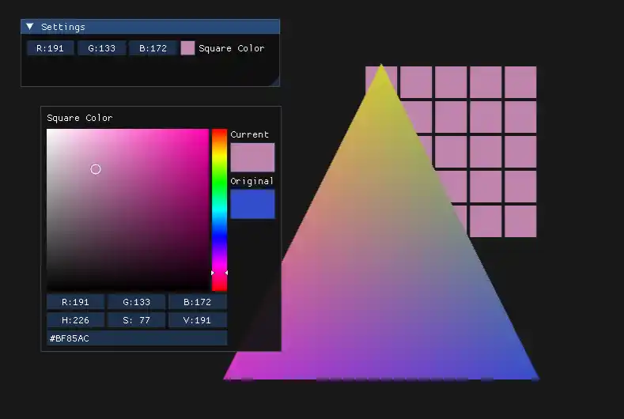

---


# 一、核心目标

将原 Shader 类中的 OpenGL 平台相关代码剥离，拆分出**抽象基类 Shader**（定义平台无关接口）和**平台实现类 OpenGLShader**（封装 OpenGL 具体逻辑），同时新增 Uniform 变量上传方法，实现上层与底层渲染 API 的解耦，为后续扩展 Vulkan/DirectX 铺路。

# 二、核心实现：新增 / 修改代码

## 1. 抽象基类：Shader.h（新增）

```cpp
#pragma once
#include <string>

namespace Hazel {

    class Shader {
    public:
        virtual ~Shader() = default;

        // 平台无关核心接口
        virtual void Bind() const = 0;
        virtual void UnBind() const = 0;

        // 工厂方法：创建对应平台的Shader实例（后续可扩展多平台分支）
        static Shader* Create(const std::string& vertexSrc, const std::string& fragmentSrc);
    };
}
```

## 2. 平台实现：OpenGLShader.h/cpp（新增 Uniform 上传方法）

## （1）OpenGLShader.h（声明新增方法）

```cpp
#pragma once
#include "Hazel/Renderer/Shader.h"
#include <string>

namespace Hazel {

    class OpenGLShader : public Shader {
    public:
        OpenGLShader(const std::string& vertexSrc, const std::string& fragmentSrc);
        ~OpenGLShader() override;

        void Bind() const override;
        void UnBind() const override;

        // 新增：Uniform变量上传方法（覆盖常用类型）
        void UploadUniformInt(const std::string& name, int value);
        void UploadUniformFloat(const std::string& name, float value);
        void UploadUniformFloat2(const std::string& name, const glm::vec2& value);
        void UploadUniformFloat3(const std::string& name, const glm::vec3& value);
        void UploadUniformFloat4(const std::string& name, const glm::vec4& value);
        void UploadUniformMat3(const std::string& name, const glm::mat3& matrix);
        void UploadUniformMat4(const std::string& name, const glm::mat4& matrix);

    private:
        uint32_t m_RendererID; // OpenGL程序对象ID
    };
}
```

## （2）OpenGLShader.cpp（实现新增 Uniform 方法）

```cpp
#include "hzpch.h"
#include "OpenGLShader.h"
#include <glad/glad.h>
#include <glm/gtc/type_ptr.hpp>

namespace Hazel {

    // 原有编译链接逻辑不变（略）
    OpenGLShader::OpenGLShader(const std::string& vertexSrc, const std::string& fragmentSrc) {
        // （保持原有OpenGL shader编译、链接逻辑不变）
    }

    // 原有Bind/UnBind逻辑不变（略）
    void OpenGLShader::Bind() const { glUseProgram(m_RendererID); }
    void OpenGLShader::UnBind() const { glUseProgram(0); }

    // 新增：Uniform上传实现（仅展示核心方法）
    void OpenGLShader::UploadUniformFloat3(const std::string& name, const glm::vec3& value) {
        GLint location = glGetUniformLocation(m_RendererID, name.c_str());
        glUniform3f(location, value.x, value.y, value.z);
    }

    void OpenGLShader::UploadUniformMat4(const std::string& name, const glm::mat4& matrix) {
        GLint location = glGetUniformLocation(m_RendererID, name.c_str());
        glUniformMatrix4fv(location, 1, GL_FALSE, glm::value_ptr(matrix));
    }

    // 其他Uniform方法（UploadUniformInt/Float2等）实现逻辑类似（略）
}
```

## 3. Renderer.cpp 修改：动态转换上传 Uniform

由于 Shader 基类未定义 Uniform 上传接口，需通过`dynamic_pointer_cast`转换到具体平台类（过渡方案）：

```cpp
void Renderer::Submit(const std::shared_ptr<Shader>& shader, const std::shared_ptr<VertexArray>& vertexArray, const glm::mat4& transform) {
    shader->Bind();
    // 动态转换到OpenGLShader，调用平台相关的Uniform上传方法
    auto openglShader = std::dynamic_pointer_cast<OpenGLShader>(shader);
    openglShader->UploadUniformMat4("u_ViewProjection", m_SceneData->ViewProjectionMatrix);
    openglShader->UploadUniformMat4("u_Transform", transform);

    vertexArray->Bind();
    RenderCommand::DrawIndexed(vertexArray);
}
```

## 4. Sandbox 新增功能：颜色控制与多方块渲染

## （1）ExampleLayer 成员变量新增

```cpp
private:
    std::shared_ptr<Hazel::Shader> m_FlatColorShader; // 新增：支持颜色Uniform的Shader
    glm::vec3 m_SquareColor = { 0.2f, 0.3f, 0.8f };   // 新增：方块颜色（ImGui控制）
    glm::vec3 m_SquarePosition;
    float m_SquareMoveSpeed = 1.0f;
```

## （2）新增 FlatColorShader（支持 u_Transform 和 u_Color）

```cpp
// ExampleLayer构造函数中新增
std::string flatColorShaderVertexSrc = R"(
    #version 330 core
    layout(location = 0) in vec3 a_Position;
    uniform mat4 u_ViewProjection;
    uniform mat4 u_Transform; // 模型矩阵
    out vec3 v_Position;
    void main(){
        gl_Position = u_ViewProjection * u_Transform * vec4(a_Position, 1.0f);
    }
)";
std::string flatColorShaderFragmentSrc = R"(
    #version 330 core
    layout(location = 0) out vec4 color;
    uniform vec3 u_Color; // 新增：颜色Uniform
    void main(){ color = vec4(u_Color, 1.0); }
)";
m_FlatColorShader.reset(Hazel::Shader::Create(flatColorShaderVertexSrc, flatColorShaderFragmentSrc));
```

## （3）OnUpdate 新增：上传颜色 Uniform 与 5x5 阵列渲染

```cpp
void OnUpdate(Hazel::Timestep ts) override {
    // （原有相机/方块移动控制逻辑不变，略）

    Hazel::Renderer::BeginScene(m_Camera);

    // 1. 上传颜色Uniform（动态转换到OpenGLShader）
    auto openglShader = std::dynamic_pointer_cast<Hazel::OpenGLShader>(m_FlatColorShader);
    openglShader->UploadUniformFloat3("u_Color", m_SquareColor);

    // 2. 5x5方块阵列渲染（复用原有逻辑，略）
    glm::mat4 transform = glm::translate(glm::mat4(1.0f), m_SquarePosition);
    glm::mat4 scale = glm::scale(glm::mat4(1.0f), glm::vec3(0.1f));
    for(int i = 0;i < 5;i++)
        for(int j = 0;j < 5;j++)
        {
            glm::vec3 pos = glm::vec3(i * 0.11f, j * 0.11f, 0.0f);
            glm::mat4 squareTransform = glm::translate(transform, pos) * scale;
            Hazel::Renderer::Submit(m_FlatColorShader, m_SquareVA, squareTransform);
        }

    // （原有三角形渲染逻辑不变，略）
    Hazel::Renderer::EndScene();
}
```

## （4）新增 ImGui 颜色选择器

```cpp
void OnImGuiRender()override {
    ImGui::Begin("Settings");
    ImGui::ColorEdit3("Square Color", glm::value_ptr(m_SquareColor)); // 实时修改方块颜色
    ImGui::End();
}
```

# 三、效果



左侧ImGui调色面板，实时控制渲染右侧方块面板的颜色

# 四、核心说明

## 1. 解耦逻辑

- **基类 Shader**：仅定义平台无关接口（Bind/UnBind/Create），上层代码依赖抽象，不关心具体实现；
- **平台类 OpenGLShader**：封装 OpenGL 的 shader 编译、链接、Uniform 上传等具体逻辑，继承自 Shader；
- **工厂方法 Create**：后续扩展 Vulkan 时，只需新增`VulkanShader`类，修改 Create 方法的分支判断，上层无感知。

## 2. 动态转换的原因

当前 Shader 基类未定义 Uniform 上传接口（因不同平台的 Uniform 处理逻辑差异较大），暂时通过`dynamic_pointer_cast`转换到具体平台类，是快速实现的过渡方案。

## 3. 新增功能价值

- **Uniform 上传方法**：支持常用类型（int/float/vec3/mat4），满足多参数渲染需求；
- **ImGui 颜色控制**：实时调整方块颜色，无需重启程序，提升调试效率；

# 五、当前局限与后续优化

1. **动态转换依赖平台类**：上层代码仍需知道具体平台（如 OpenGLShader），耦合度略高；
2. **基类缺少 Uniform 抽象**：后续可在 Shader 基类中添加纯虚 Uniform 接口（如`virtual void SetUniformMat4(...) = 0`），让平台类实现，去掉动态转换；
3. **无 Uniform 缓存**：每次上传都调用`glGetUniformLocation`，可在 OpenGLShader 中缓存 Uniform 位置，提升性能。

# 总结

本次优化核心是 “分离抽象与实现”，通过拆分 Shader 基类和平台类，实现了上层与 OpenGL 的解耦。同时新增 Uniform 上传和 ImGui 颜色控制功能，既提升了引擎的灵活性，又优化了开发调试体验，为后续多平台扩展和复杂渲染功能打下基础。