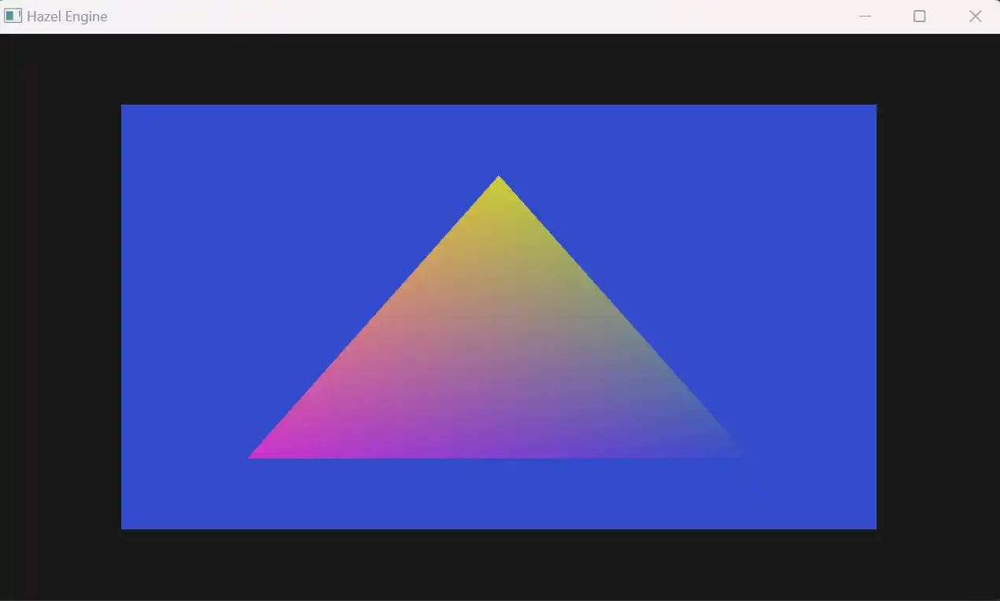

---


# 一、VertexArray 抽象背景与目标

在 OpenGL 中，**顶点数组对象（VAO）** 是管理顶点缓冲（VBO）、索引缓冲（IBO）和顶点属性配置的核心容器，并且使用`glVertexAttribPointer`函数来决定VAO**通过哪种方式来挖取** VBO中的数据。但 DirectX 等其他渲染 API 无此概念，所以目前是先创建VertexArray类，至于Dx这种的，里面可能会有对应VertexArray的API，但里面的执行代码弄成空的就行了。

**核心目标**：

- 封装 VAO 的创建、绑定、VBO/IBO 关联及顶点属性配置逻辑；
- 提供平台无关的接口，上层代码无需感知 OpenGL 原生调用；

同之前的几节课一样，这里仍然是有一些关于Vertex Array的代码要把它抽象化：

```cpp
// 1. 创建VertexArray，这一段还没抽象化
glGenVertexArrays(1, &m_VertexArray);
glBindVertexArray(m_VertexArray);

// 这一段已经成功抽象化了
{
	BufferLayout layout = {
		{ShaderDataType::FLOAT3, "a_Pos" },
		{ShaderDataType::FLOAT4, "a_Color" }
	};
	m_VertexBuffer->SetBufferLayout(layout);
}

BufferLayout layout = m_VertexBuffer->GetBufferLayout();
int index = 0;
// 2. 指定VAO挖数据的方法，这一段也没抽象化
for (const BufferElement& element : layout)
{
	glEnableVertexAttribArray(index);
	glVertexAttribPointer(index,
	GetShaderTypeDataCount(element.GetType()),
	GetShaderDataTypeToOpenGL(element.GetType()), 
		element.IsNormalized()? GL_TRUE : GL_FALSE,
		layout.GetStride(),
		(const void*)(element.GetOffset()));
	index++;
}
```

# 二、VertexArray 基类设计

定义纯虚接口，规范 VAO 的核心操作，上层通过该接口完成顶点数据的整体管理。

这里单独建一个VertexArray的cpp和h文件，之所以单独建立cpp和h文件，是因为Cherno还不确定相关的VertexArray的内容以后还会不会会保留，毕竟DX里是没有这个概念的

## 2.1 基类接口（VertexArray.h）

```cpp
#pragma once
#include "Hazel/Renderer/Buffer.h"
#include <memory>

namespace Hazel {
    class VertexArray
    {
    public:
        virtual ~VertexArray() = default;

        // 绑定/解绑VAO（OpenGL核心操作）
        virtual void Bind() const = 0;
        virtual void Unbind() const = 0;

        // 关联VBO：VAO记录VBO引用，并配置顶点属性（核心逻辑封装）
        virtual void AddVertexBuffer(const std::shared_ptr<VertexBuffer>& vertexBuffer) = 0;
        // 关联IBO：VAO记录IBO引用
        virtual void SetIndexBuffer(const std::shared_ptr<IndexBuffer>& indexBuffer) = 0;

        // 获取关联的IBO（用于绘制时的索引数量）
        virtual const std::shared_ptr<IndexBuffer>& GetIndexBuffer() const = 0;

        // 工厂函数：根据当前渲染API创建对应平台的VAO实例
        static VertexArray* Create();
    };
}
```

## 2.2 工厂函数实现（VertexArray.cpp）

```cpp
#include "Hazel/Renderer/VertexArray.h"
#include "Platform/OpenGL/OpenGLVertexArray.h"

namespace Hazel {
    VertexArray* VertexArray::Create()
    {
        switch (Renderer::GetAPI())
        {
            case RendererAPI::None:    HZ_CORE_ASSERT(false, "不支持None渲染API！");
            case RendererAPI::OpenGL:  return new OpenGLVertexArray();
        }

        HZ_CORE_ASSERT(false, "未知渲染API！");
        return nullptr;
    }
}
```

# 三、OpenGL 平台实现（OpenGLVertexArray）

继承基类，封装 OpenGL 原生 VAO 操作，将顶点属性配置逻辑（`glVertexAttribPointer`等）收拢到`AddVertexBuffer`中。

## 3.1 头文件（OpenGLVertexArray.h）

```cpp
#pragma once
#include "Hazel/Renderer/VertexArray.h"
#include <vector>

namespace Hazel {
    class OpenGLVertexArray : public VertexArray
    {
    public:
        OpenGLVertexArray();
        virtual ~OpenGLVertexArray();

        virtual void Bind() const override;
        virtual void Unbind() const override;

        virtual void AddVertexBuffer(const std::shared_ptr<VertexBuffer>& vertexBuffer) override;
        virtual void SetIndexBuffer(const std::shared_ptr<IndexBuffer>& indexBuffer) override;
        virtual const std::shared_ptr<IndexBuffer>& GetIndexBuffer() const override { return m_IndexBuffer; }

    private:
        uint32_t m_RendererID = 0; // OpenGL VAO对象ID
        std::vector<std::shared_ptr<VertexBuffer>> m_VertexBuffers; // 关联的VBO列表
        std::shared_ptr<IndexBuffer> m_IndexBuffer; // 关联的IBO
        uint32_t m_VertexAttribIndex = 0; // 顶点属性索引（自动递增，避免手动管理）
    };
}
```

## 3.2 实现文件（OpenGLVertexArray.cpp）

```cpp
#include "hzpch.h"
#include "OpenGLVertexArray.h"
#include "Hazel/Renderer/Buffer.h"
#include <glad/glad.h>

namespace Hazel {
	// 平台工具函数：ShaderDataType转OpenGL原生类型（仅在OpenGL实现中使用）
	static GLenum ShaderDataTypeToOpenGLBaseType(ShaderDataType type)
	{
	    switch (type)
	    {
		    case ShaderDataType::Float:		return GL_FLOAT;
		    case ShaderDataType::Float2:	return GL_FLOAT;
		    case ShaderDataType::Float3:	return GL_FLOAT;
		    case ShaderDataType::Float4:	return GL_FLOAT;
		    case ShaderDataType::Mat3:		return GL_FLOAT;
		    case ShaderDataType::Mat4:		return GL_FLOAT;
		    case ShaderDataType::Int:		return GL_INT;
		    case ShaderDataType::Int2:		return GL_INT;
		    case ShaderDataType::Int3:		return GL_INT;
		    case ShaderDataType::Int4:		return GL_INT;
		    case ShaderDataType::Bool:		return GL_BOOL;
	    }
	}

    OpenGLVertexArray::OpenGLVertexArray()
    {
        // 创建OpenGL VAO对象
        glCreateVertexArrays(1, &m_RendererID);
    }

    OpenGLVertexArray::~OpenGLVertexArray()
    {
        // 释放VAO资源
        glDeleteVertexArrays(1, &m_RendererID);
    }

    void OpenGLVertexArray::Bind() const
    {
        glBindVertexArray(m_RendererID);
    }

    void OpenGLVertexArray::Unbind() const
    {
        glBindVertexArray(0);
    }

    void OpenGLVertexArray::AddVertexBuffer(const std::shared_ptr<VertexBuffer>& vertexBuffer)
    {
        HZ_CORE_ASSERT(vertexBuffer, "VertexBuffer为空！");
        HZ_CORE_ASSERT(vertexBuffer->GetBufferLayout().GetElement().size() > 0, "VertexBuffer布局为空！");

        // 绑定VAO和VBO（VAO会记录VBO的绑定状态）
        Bind();
        vertexBuffer->Bind();

        // 自动配置顶点属性（从VBO的BufferLayout中读取配置）
        const auto& layout = vertexBuffer->GetBufferLayout();
        for (const auto& element : layout.GetElement())
        {
            glEnableVertexAttribArray(m_VertexAttribIndex);
            glVertexAttribPointer(
                m_VertexAttribIndex,
                element.GetComponentCount(), // 组件数量（如vec3为3）
                ShaderDataTypeToOpenGLBaseType(element.Type), // OpenGL数据类型
                element.Normalized ? GL_TRUE : GL_FALSE, // 是否归一化
                layout.GetStride(), // 顶点步长（单个顶点总字节数）
                (const void*)element.Offset // 属性偏移量
            );
            m_VertexAttribIndex++;
        }

        // 存储VBO引用，防止智能指针提前释放
        m_VertexBuffers.push_back(vertexBuffer);
    }

    void OpenGLVertexArray::SetIndexBuffer(const std::shared_ptr<IndexBuffer>& indexBuffer)
    {
        HZ_CORE_ASSERT(indexBuffer, "IndexBuffer为空！");

        // 绑定VAO和IBO（VAO会记录IBO的绑定状态）
        Bind();
        indexBuffer->Bind();
        
        m_IndexBuffer = indexBuffer;
    }
}
```

# 四、上层代码适配及一些优化

修改`Application.cpp`，通过`VertexArray`抽象接口完成渲染初始化，移除所有`glGenVertexArrays`、`glBindVertexArray`、`glVertexAttribPointer`原生调用。

## 4.1 核心适配代码

这里新建一个纯色长方形验证（`m_BlueShader`,`m_SqrVA`）

```cpp
// 渲染初始化：VAO、VBO、IBO
// 顶点数据与布局
float vertices[3 * 7] = {
	-0.5f, -0.5f, 0.0f, 0.8f, 0.2f, 0.8f, 1.0f,
	 0.5f, -0.5f, 0.0f, 0.2f, 0.3f, 0.8f, 1.0f,
	 0.0f,  0.5f, 0.0f, 0.8f, 0.8f, 0.2f, 1.0f
	};
BufferLayout layout = {
	{ShaderDataType::Float3, "a_Pos"},
	{ShaderDataType::Float4, "a_Color"}
};

// 1. 创建VBO并设置布局
// 移除m_VertexBuffer等，仅保留VAO
std::shared_ptr<VertexBuffer> vertexBuffer;
vertexBuffer.reset(VertexBuffer::Create(vertices, sizeof(vertices)));
vertexBuffer->SetLayout(layout);

// 2. 创建IBO
uint32_t indices[3] = { 0, 1, 2 };
std::shared_ptr<IndexBuffer> indexBuffer;
indexBuffer.reset(IndexBuffer::Create(indices, sizeof(indices) / sizeof(uint32_t)));

// 3. 创建VAO并关联VBO、IBO（核心修改：纯抽象接口）
m_VertexArray.reset(VertexArray::Create());
m_VertexArray->AddVertexBuffer(vertexBuffer);
m_VertexArray->SetIndexBuffer(indexBuffer);

// Blue Squre
// 渲染初始化：VAO、VBO、IBO
// 顶点数据与布局
float squareVertices[3 * 4] = {
	-0.75f, -0.75f, 0.0f, 
	 0.75f, -0.75f, 0.0f, 
	 0.75f,  0.75f, 0.0f,
	-0.75f,  0.75f, 0.0f
};
BufferLayout squareVBLayout = {
	{ShaderDataType::Float3, "a_Pos"}
};

// 1. 创建VBO并设置布局
std::shared_ptr<VertexBuffer> squareVB;
squareVB.reset(VertexBuffer::Create(squareVertices, sizeof(squareVertices)));
squareVB->SetLayout(squareVBLayout);

// 2. 创建IBO
uint32_t squareIndices[6] = { 0, 1, 2, 2, 3, 0 };
std::shared_ptr<IndexBuffer> squareIB;
squareIB.reset(IndexBuffer::Create(squareIndices, sizeof(squareIndices) / sizeof(uint32_t)));

// 3. 创建VAO并关联VBO、IBO（核心修改：纯抽象接口）
m_SqrVA.reset(VertexArray::Create());
m_SqrVA->AddVertexBuffer(squareVB);
m_SqrVA->SetIndexBuffer(squareIB);

// 创建shader
// 顶点着色器src
std::string vertexSrc = R"(
	#version 330 core

	layout(location = 0) in vec3 a_Position;
	layout(location = 1) in vec4 a_Color;

	out vec3 v_Position;
	out vec4 v_Color;

	void main(){
		gl_Position = vec4(a_Position, 1.0f);
		v_Position = a_Position;
		v_Color = a_Color;
	}
)";
// 片段着色器
std::string fragmentSrc = R"(
	#version 330 core

	layout(location = 0) out vec4 color;

	in vec3 v_Position;
	in vec4 v_Color;

	void main(){
		color = vec4(v_Position * 0.5 + 0.5, 1.0f);
		color = v_Color;
	}
)";
m_Shader.reset(new Shader(vertexSrc, fragmentSrc));

// 创建shader2
// 顶点着色器src
std::string blueShaderVertexSrc = R"(
	#version 330 core

	layout(location = 0) in vec3 a_Position;

	out vec3 v_Position;

	void main(){
		gl_Position = vec4(a_Position, 1.0f);
		v_Position = a_Position;
	}
)";
// 片段着色器
std::string blueShaderFragmentSrc = R"(
	#version 330 core

	layout(location = 0) out vec4 color;

	in vec3 v_Position;

	void main(){
		color = vec4(0.2, 0.3, 0.8, 1.0);
	}
)";
m_BlueShader.reset(new Shader(blueShaderVertexSrc, blueShaderFragmentSrc));


// 后续渲染流程：绑定VAO后直接绘制
m_BlueShader->Bind();
m_SqrVA->Bind();
// 在VertexArray新增访问VB,IB方法
glDrawElements(GL_TRIANGLES, m_SqrVA->GetIndexBuffer()->GetCount(), GL_UNSIGNED_INT, nullptr);

m_Shader->Bind();
m_VertexArray->Bind(); 
glDrawElements(GL_TRIANGLES, m_VertexArray->GetIndexBuffer()->GetCount(), GL_UNSIGNED_INT, nullptr); 
```

## 4.2 结果



# 五、渲染器全抽象：Application 与平台解耦的核心价值

1. **维护性提升**：上层无平台原生调用，问题定位聚焦平台实现层，调试效率翻倍；
2. **多 API 无缝扩展**：新增 Vulkan/DirectX 仅需实现对应平台类，上层代码零修改；
3. **开发效率优化**：开发者专注抽象接口，无需深耕多 API 差异，模块并行开发不阻塞；
4. **架构更健壮**：遵循依赖倒置原则，模块耦合度低，迭代 / 修复无连锁反应；
5. **迭代成本降低**：新渲染特性（如 PBR）仅需扩展抽象接口，无需重构业务逻辑。

核心意义：让引擎从 “单平台绑定” 升级为 “多后端兼容”，具备长期演进能力，为多平台发布、硬件特性迭代奠定架构基础。