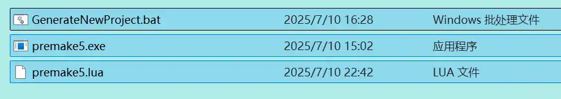

---


# 一、链接github远程仓库

在引擎开发中，使用 Git 管理代码可实现版本回溯、协作开发

## 1.1 准备工作：创建 GitHub 仓库与本地配置

- 新建github远程仓库

  登录 GitHub 账号，点击右上角「+」→「New repository」；
填写仓库名（如Hazel-Engine），选择「Public/Private」，不勾选「Add a README file」「Add .gitignore」等（本地手动配置更灵活），点击「Create repository」；
记录仓库的 HTTPS/SSH 地址（如https://github.com/your-username/Hazel-Engine.git），后续关联本地项目。

- 配置本地.gitignore（关键：排除无需提交的文件）

⚠️ 注意：.gitignore需放在项目根目录（而非.git文件夹下，.git是 Git 自动生成的隐藏目录，不要手动修改），用于声明无需提交到 Git 的文件 / 目录（如编译产物、IDE 配置）。

新建.gitignore文件，内容如下：

  ```txt
  # Binaries
  # 编译产物目录（二进制文件）
  **/bin/
  bin-int/
  
  # Visual Studio files and folder
  .vs/
  **.sln
  **.vcxproj
  **.vcxproj.filters
  **.vcxproj.user
  **.csproj
  ```

## 1.2 本地项目关联远程仓库（Git 命令操作）

打开项目根目录的终端（如 VS Code 终端、Windows CMD），执行以下命令：

  ```cmd
# 1. 初始化本地Git仓库（仅首次执行）
git init

# 2. 关联GitHub远程仓库（替换为你的仓库URL）
git remote add origin https://github.com/your-username/Hazel-Engine.git

# 3. 查看远程仓库关联是否成功（可选，验证步骤）
git remote -v

# 4. 将所有文件添加到暂存区（.表示所有文件，*会忽略隐藏文件，推荐用.）
git add .

# 5. 提交暂存区文件到本地仓库（-m后为提交注释，描述本次修改内容）
git commit -m "init: 初始化Hazel引擎项目，包含基础目录结构"

# 6. （可选）若本地分支名不是main，重命名为main（GitHub默认主分支为main）
git branch -M main

# 7. 将本地代码推送到GitHub远程仓库（首次推送需输入GitHub账号密码/Token）
git push origin main
  ```


## 1.3 常用 Git 命令速查（日常开发必备）

| 命令                     | 功能说明                      | 示例                                                                  |
| ---------------------- | ------------------------- | ------------------------------------------------------------------- |
| git add .              | 将根目录下所有修改 / 新增文件加入暂存区     | git add .                                                           |
| git reset .            | 将暂存区所有文件撤回（不删除本地修改）       | git reset .                                                         |
| git status             | 查看当前文件状态（暂存区 / 未暂存 / 未跟踪） | git status                                                          |
| git commit -m "msg"    | 提交暂存区文件到本地仓库，msg 为修改描述    | git commit -m "feat: 添加Premake配置脚本"                                 |
| git push origin main   | 将本地 main 分支代码推送到远程仓库      | git push origin main                                                |
| git pull origin main   | 拉取远程 main 分支最新代码到本地（避免冲突） | git pull origin main                                                |
| git clone <URL> [本地目录] | 克隆远程仓库到本地（首次获取项目时用）       | git clone https://github.com/your-username/Hazel-Engine.git ./Hazel |
| git log                | 查看提交历史（按 q 退出）            | git log                                                             |


# 二.Premake维护项目（自动化工程配置）

手动配置 Visual Studio 项目属性（如包含目录、宏定义）繁琐且易出错，Premake 通过 Lua 脚本实现 “一次配置，多平台生成”，大幅提升效率。

## 2.1 什么是 Premake？为什么用它？

- 定义：开源项目生成工具，通过 Lua 脚本描述项目结构，一键生成 VS/Xcode/Makefile 等工程文件；

- 核心优势：
  避免重复劳动：多配置（Debug/Release/Dist）、多平台（Windows/Linux）只需维护一份 Lua 脚本；
  降低协作成本：团队成员只需执行脚本即可生成一致的工程文件，无需手动同步配置；
  易用性高于 CMake：Lua 语法简洁，学习成本低，适合中小项目快速上手。

## 2.2 Premake 环境准备

下载 Premake5：访问Premake 官网，下载 Windows 版本；

解压文件：在项目根目录新建vendor/premake文件夹，将解压后的premake5.exe放入其中（路径：vendor/premake/premake5.exe）；

（可选）保存 Premake 许可证：将官网的 LICENSE 文件下载到vendor/premake目录，保持开源合规。

## 2.3 编写 Premake 脚本（premake5.lua）

在项目根目录新建premake5.lua文件，内容如下（关键配置已加注释）：
```lua
EngineName = "Hazel"

workspace (EngineName)
    architecture "x64" -- 平台
    startproject "Sandbox" -- 启动项目

    configurations {"Debug", "Release", "Dist"} -- 配置

outputdir = "%{cfg.buildcfg}-%{cfg.system}-%{cfg.architecture}"

project (EngineName)
    location (EngineName)
    kind "SharedLib" -- 配置类型
    language "C++"
    staticruntime "Off" -- 动态链接运行库

    targetdir ("bin/" .. outputdir .. "/%{prj.name}") -- 输出目录
    objdir ("bin-int/" .. outputdir .. "/%{prj.name}") -- 中间文件目录

    files {
        "%{prj.name}/src/**.h",
        "%{prj.name}/src/**.cpp"
    }

    -- 包含目录
    includedirs {
        "%{prj.name}/vendor/spdlog/include",
        "%{prj.name}/src"
    }

    filter "system:windows"
        cppdialect "C++17"
        systemversion "latest"

        -- 预处理器
        defines {
            "HZ_PLATFORM_WINDOWS",
            "HZ_BUILD_DLL"
        }

        -- dll复制命令
        postbuildcommands {
            -- 复制DLL到Sandbox输出目录
            "{COPY} \"%{cfg.buildtarget.relpath}\" \"../bin/" .. outputdir .. "/Sandbox/\""
        }

    filter "configurations:Debug"
        defines "HZ_DEBUG"
        runtime "Debug" -- 运行库, Debug版本
        symbols "On"

    filter "configurations:Release"
        defines "HZ_RELEASE"
        runtime "Release" -- 运行库, Release版本
        optimize "On"

    filter "configurations:Dist"
        defines "HZ_DIST"
        runtime "Release"
        optimize "On"

project "Sandbox"
    location "Sandbox"
    kind "ConsoleApp"
    language "C++"
    staticruntime "Off" -- 动态链接运行库

    targetdir ("bin/" .. outputdir .. "/%{prj.name}") -- 输出目录
    objdir ("bin-int/" .. outputdir .. "/%{prj.name}") -- 中间文件目录

    files {
        "%{prj.name}/src/**.h",
        "%{prj.name}/src/**.cpp"
    }

    includedirs {
        "Hazel/src",
        "Hazel/vendor",
        "Hazel/vendor/spdlog/include",
    }

    links { "Hazel" }

    filter "system:windows"
        cppdialect "C++17"
        staticruntime "On"
        systemversion "latest"
        defines { "HZ_PLATFORM_WINDOWS" }

    filter "configurations:Debug"
        defines "HZ_DEBUG"
        runtime "Debug" -- 运行库, Debug版本
        symbols "On"

    filter "configurations:Release"
        defines "HZ_RELEASE"
        runtime "Release" -- 运行库, Release版本
        optimize "On"

    filter "configurations:Dist"
        defines "HZ_DIST"
        runtime "Release"
        optimize "On"
```

### 关键配置详解

1. staticruntime：控制 **CRT （C++ 运行库）** 的**链接方式**

   staticruntime 决定了程序是将 CRT “**打包进自身**” 还是 “**依赖外部 DLL**”，核心影响程序的部署和依赖。

- 作用：选择 CRT 的链接模式，仅支持 **On（静态链接）** 和 **Off（动态链接）** 两种值。

- 设为 “Off” 的原因：项目类型是 SharedLib（动态库），动态库若用静态链接 CRT，可能导致主程序（如 Sandbox）与动态库（EngineName）使用不同的 CRT 实例，引发内存管理冲突（比如动态库中分配的内存，主程序中释放会崩溃）。设为 Off（动态链接）可确保主程序和动态库共享同一 CRT DLL，避免此类冲突。

2. runtime：控制 CRT 的**版本类型**

   runtime 决定了程序使用 “**调试版 CRT**” 还是 “**发布版 CRT**”，核心影响程序的调试能力和运行效率。

- 作用：选择 CRT 的功能版本，主要支持 **Debug（调试版）** 和 **Release（发布版）** 两种值。

- 两种版本的区别：

  **runtime "Debug"（调试版 CRT）**：仅用于开发调试，包含调试信息、内存泄漏检测、断言（assert）等调试功能。
  优点：能捕获内存越界、空指针等错误，辅助定位 bug；
  缺点：运行效率低，体积大，且依赖的调试版 DLL（如 msvcp140d.dll）不随系统默认安装。

  **runtime "Release"（发布版 CRT）**：用于最终交付，移除了调试信息和调试功能，进行了代码优化。
  优点：运行速度快，体积小，依赖的发布版 DLL（如 msvcp140.dll）是系统常见组件；
  缺点：无法使用调试功能，出错时难以定位原因。

- 在 Debug 配置设为 “Debug” 的原因：filter "configurations:Debug" 表示该配置仅对 “Debug 编译模式” 生效。开发调试阶段需要借助调试版 CRT 的断言、内存检测等功能排查 bug，因此必须将 runtime 设为 Debug；
  若误设为 Release，调试时会丢失关键调试信息，无法有效定位问题。

## 2.4 编写一键生成脚本（generate.bat）

为避免每次手动输入 Premake 命令，在项目根目录新建generate.bat文件，双击即可生成 VS2022 工程：

```bat
call vendor\bin\premake\premake5.exe vs2022
PAUSE
```

- 生成与使用步骤：
  双击generate.bat，终端显示 “Generating Visual Studio 2022 project files...” 即为成功；
  项目根目录会生成Hazel.sln解决方案文件，双击打开即可开始开发；
  后续若修改项目配置（如新增源文件、添加宏定义），只需修改premake5.lua，重新运行generate.bat即可更新工程。

-----------------------------------------------------------------


# 三.预编译头（提升编译速度）

项目中大量.cpp 文件会重复包含\<iostream>\<string>等标准头文件，预编译头可将这些头文件 “提前编译一次”，后续编译直接复用，大幅减少重复劳动。

## 3.1 实现步骤

- 创建预编译头文件（hzpch.h/.cpp）

  src文件夹下创建hzpch类

  hzpch.h

```cpp
  #pragma once
  
  #include <iostream>
  #include <memory>
  #include <utility>
  #include <algorithm>
  #include <functional>
  
  #include <string>
  #include <sstream>
  #include <vector>
  #include <unordered_map>
  #include <unordered_set>
  
  #ifdef HZ_PLATFORM_WINDOWS
  #include <Windows.h>
  #endif
  ```

  hzpch.cpp

  ```cpp
  #include "hzpch.h"
  ```

- 启用预编译头

  前面的premake5.lua中，为Hazel和Sandbox项目添加以下配置：

  ```lua
    -- 预编译头 
    pchheader "hzpch.h"
    pchsource "Hazel/src/hzpch.cpp"
  ```

  **在每个cpp文件的顶部引入hzpch.h文件,不然会报错**

  重新生成后，premake预编译头设置的对应效果

![[009.webp]]

![[010.webp]]


# Tips

## Premake创建新项目

有了premake，我们可以写一个premake文件，以后每次需要新建项目，不需要每次都麻烦的配置属性了，只需要双击

```lua
projname = "NewProject"

workspace (projname)  -- 使用括号包裹变量
    architecture "x64"
    configurations { "Debug", "Release" }

outputdir = "%{cfg.buildcfg}-%{cfg.system}-%{cfg.architecture}"

project (projname) 
    location (projname) 
    kind "ConsoleApp"
    language "C++"
    
    -- 创建必要的目录结构
    os.mkdir(projname .. "/src")  -- 这里不能用%{prj.name}，不知道为什么
    
    targetdir ("bin/" .. outputdir .. "/%{prj.name}")
    objdir ("bin/intermediate/" .. outputdir .. "/%{prj.name}")

    files {
        "%{prj.name}/src/**.h",
        "%{prj.name}/src/**.cpp"
    }
    
    -- 如果src目录为空，创建默认main.cpp
    if #os.matchfiles("%{prj.name}/src/**.cpp") == 0 then
        local main_cpp = [[
#include <iostream>

int main() {
    std::cout << "Hello, NewProject!" << std::endl;
    return 0;
}
]]
        -- 使用直接路径
        local file = io.open(projname .. "/src/main.cpp", "w")
        file:write(main_cpp)
        file:close()
    end

    filter "system:windows"
        cppdialect "C++17"
        staticruntime "On"
        systemversion "10.0"
        defines { "WINDOWS_PLATFORM" }

    filter "configurations:Debug"
        defines { "DEBUG" }
        symbols "On"

    filter "configurations:Release"
        defines { "RELEASE" }
        optimize "On"
```

```bat
call premake5.exe vs2022
PAUSE
```



放在同一级目录即可，保持简洁，点击bat文件就创建了新项目，可以在lua文件先修改项目名称

## C++知识：std::bind 用法（函数绑定）

std::bind是 C++11 引入的函数绑定工具，用于 “固定函数的部分参数” 或 “调整参数顺序”，返回一个可调用的函数对象，常用于回调函数、事件处理等场景。

1.基础用法示例

```cpp
#include <iostream>
#include <functional>  // std::bind所需头文件
using namespace std;
using namespace std::placeholders;  // 占位符（_1, _2, ...）所在命名空间

// 原函数：接收5个int参数，打印所有参数
void PrintNumbers(int a, int b, int c, int d, int e) {
    cout << "参数：" << a << " " << b << " " << c << " " << d << " " << e << endl;
}

int main() {
    int fixedA = 1, fixedB = 2, fixedC = 3;

    // 1. 绑定部分参数，用占位符表示后续传入的参数
    // 含义：固定PrintNumbers的前3个参数为fixedA(1)、fixedB(2)、fixedC(3)，
    // 后2个参数用占位符_2、_1表示（顺序调整：_1对应后续调用的第1个参数，_2对应第2个）
    auto BoundFunc = bind(PrintNumbers, fixedA, fixedB, fixedC, _2, _1);

    // 2. 调用绑定后的函数对象
    // 传入的4对应_1，5对应_2 → 最终调用PrintNumbers(1, 2, 3, 5, 4)
    BoundFunc(4, 5);  // 输出：参数：1 2 3 5 4

    // 3. 用std::function指定函数对象类型（可选，比auto更明确）
    function<void(int, int)> BoundFuncWithType = bind(PrintNumbers, fixedA, fixedB, fixedC, _2, _1);
    BoundFuncWithType(6, 7);  // 输出：参数：1 2 3 7 6

    return 0;
}
```

2.核心概念解析
- 占位符（\_1, \_2, ...）：
  来自std::placeholders命名空间，代表绑定后的函数对象被调用时，传入的第 N 个参数；
  例如\_1是第 1 个参数，\_2是第 2 个参数，最多支持\_20。

- 参数绑定规则：
  固定参数：在bind时直接传入具体值（如fixedA），后续调用无需再传；
  占位参数：用_N表示，后续调用时必须传入对应数量的参数（如绑定后函数需要 2 个参数，调用时必须传 2 个）。

- 返回值：
  std::bind返回一个匿名函数对象，通常用auto接收；
  若需明确类型，可使用std::function<返回值类型(参数类型1, 参数类型2, ...)>指定（如function<void(int, int)>）。

3.常见用途
- 回调函数参数固定：比如按钮点击回调需要传递用户数据，可通过bind固定数据参数；
- 成员函数绑定：绑定类的成员函数时，需传入this指针（如bind(&ClassName::Func, this, \_1)）；
- 函数参数顺序调整：如示例中交换后两个参数的顺序。
